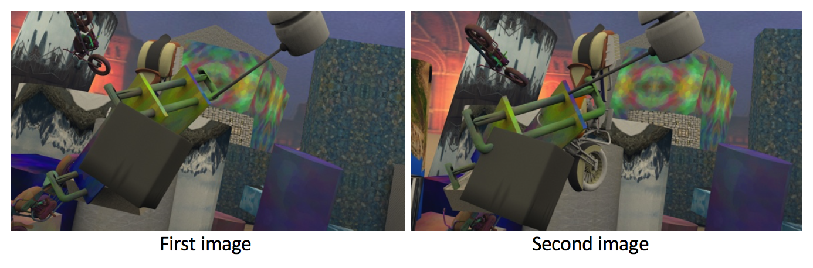
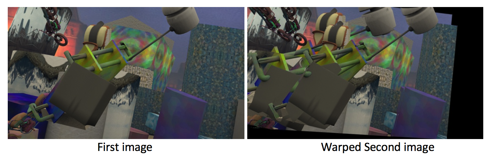
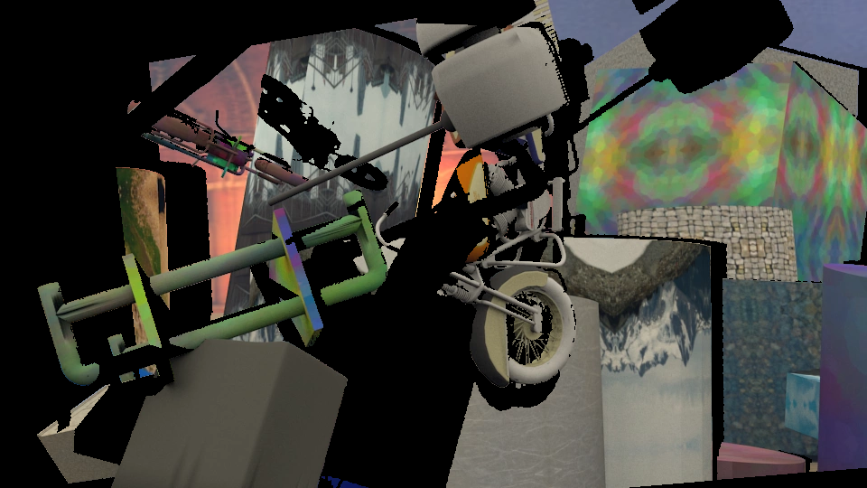

# Style Transfer for Videos

Style transfer is a technique which allows people to transfer the style of an artistic painting onto any arbitrary picture. It employs convolutional neural network to achive the transfer, and could be applied to not only pictures but also videos. This repo is a pytorch implementation of style transfer. 

## Environment configuration

All the codes are written in Python3.6. To quickly install all the packages needed in this project, conda environment management tool is recommended. You can use the environment.yml file we provide to set up the environment if you have conda installed.   

 `conda env create -f environment.yml`
 
 This will create a environment in which all needed packages have been installed. To switch to the environment you just created: `conda activate styleTransfer`. `styleTransfer` is the name of the environment, which you can find in `environment.yml`. Click [here](https://docs.conda.io/projects/conda/en/latest/user-guide/tasks/manage-environments.html) for more details on conda environment management.
 
## Intuition 

There are two common approaches for style transfer. One is optimization-based, the other is deep-learning-based. The optimization one, as its name indicates, is trying to minimize the content and style difference between the regular image and the style reference. Take a white-noise image, the loss function is the style difference between the white-noise image and the style image. Gradient descent is applied to perform the optimization. The pros of this approach is that it could transfer any arbitrary style onto an image each time, and the cons is also very obvious, the whole optimizition thing is very computationally expensive, which makes this approach not suitable for video input. 

Deep learning, instead, addresses this problem. Once a style-transfer model is trained, only a single pass is needed to stylize a picture. But you may need to train another network for a different style. To explain the intuition behind this approach, you may want to know a little bit object detection. 

When we are looking at a picture, it is very easy for us human to recognize what's inside the picture. But how does that happen? Well, in order to recognize those objects, we must have developed an understanding to the image. There are countless neurons in our brain, and those neurons are responsible for processing different pieces of information. Some neurons analyze the content of this image, some other neurons analyze the style information. The whole thing just happen naturally inside our brain. Thanks to deep learning, we are now able to mimic human brain, and it allows us to extract certain piece of information we want. A well-trained object detection model such as VGG16 could serve the purpose. 

Researchers found that the output of some layers of an object detection model contain the style information while other layers contain the content information. Once we extract the style and content from an image, we can use another network to capture the pattern of stransfering a certain style. As you may notice, we have two networks here, one is a pre-trained object detection network, which serve as the brain of the style transfer to help extract the style and content, and we need another set of neurons to combine the two part. 

## Video input

Video style transfer is very similar to image style transfer. They could have exactly the same architecture, but different in the ways they pre-process the image. 

Consider the difference between video and image, video itself has a time dimension. A 10-second video consists of thousands of frames, and each pair of frames is strongly correlated with each other because  over 90% of the content is the same. If we just use image style transfer model to transfer style for video, what would happen is the model entirely ignores the temporal correlation of each frame, and the output image still has the same style, but the color of the same content varies. If you simply put all frames together without considering temporal correlation, the resulting video will look very flickering. And the solution is Optical flow. 

## Optical flow

Optical flow is the key for video style transfer. Simply put, optical flow captures and keeps track of the movement of the same content in two image. We not only want to minimize the content and style difference of two image, but also make sure the style (or color more accurately) of the same content stay consistent. To achieve that, we need to figure out a way to calculate the style difference of the same content. using a more accurate term, we want to minimize the temporal loss, and this is where optical flow comes into play.

I am not going to dig deep into how optical flow works theoretically but only focus on how to incorporate optical flow into the image transfer model. 

Take two consecutive frames and the optical flow from second image to first image, that means we can apply the optical flow on second image to warp the content that show up in both first image and second image to where it is in the first image. 

Essentially, the optical flow is a offset matrix with the same size of the image. Each value in the matrix corresponds to how to move the pixel at that position so that it matches where it is in the first image.

Look at an example: 

The shared content are bikes, the hammer, and wome backgroud. 

After applying the optical flow onto second image, here is what whould happen:

As you can see, both the hammer and bike move to where they are in the first image. In order to accommondate the move, the image is somehow distorted, so 0 is filled at some places to keep size of the image. 

Before we move forward, there is one more step. It's obvious that there are noise in the two image. Those unmoved objects and background are not desired in the model. It does not make sense to subtract the pixel that does not refer to the same thing. A mask is introduced to cover it up. 

Below is the masked image. 

As is shown in the masked picture, only the content shows up in both image is kept. All the noise has been masked.

With the same content in the same place and all noise covered up, we are now able to do a pixel-wise subtraction to calculate the temporal loss, and keep it low between two consecutive frames. Note that this step is after we stylize the two image, because eventually, the temporal coherence of the stylized video is the goal. 

Here I used a well-organized dataset that contains optical flow, mask, follow the [link](https://lmb.informatik.uni-freiburg.de/resources/datasets/SceneFlowDatasets.en.html) for more information about the data. You can also calculate the optical flow and mask using open sourse tool, such as deepMatch2. 

I also upload the sample code of using the optical flow and mask in [here]() for your reference.
